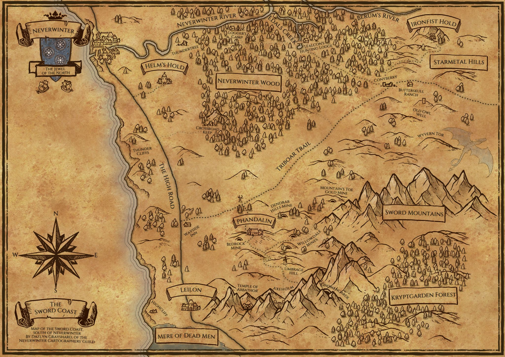

# 🏰 Welcome to the D&D Campaign Library

*"A place where heroes rise, mysteries unfold, and legends are written..."*

---
## 📖 Explore the Campaign
Navigate through different sections to find what you need:

- [📜 Game Logs](logs.md) – Track past sessions and key events.
- [🗺️ Locations](Locations.md) – Learn about cities, dungeons, and landmarks.
- [🧙 NPCs](NPCs.md) – Meet the important characters in your adventure. 
- [⚔️ History](history.md) – Learn about the History of the world.
- [special rules](bloodbowl.md)

---
## 🗺️ Map

---
## 📌 How to Use
- Use the **sidebar** to navigate quickly.
- Click on a section to expand details.
- Use the **search bar** to find NPCs, locations, or rules instantly.

---
## 🎭 Player Contributions
Players can:
- Add their own **character journals**.
- Suggest **lore updates** via Pull Requests.
-
